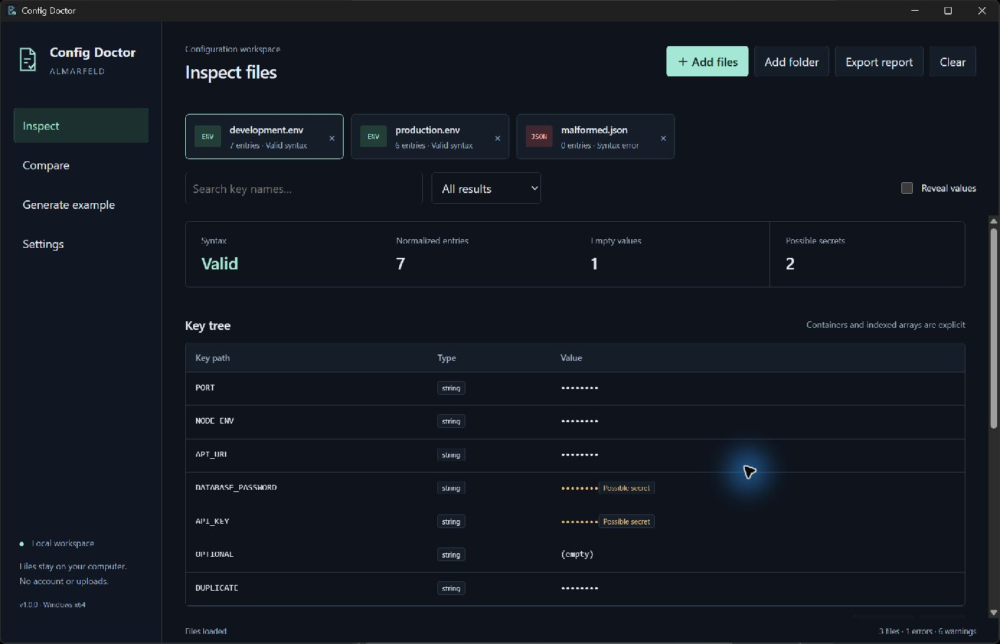

# Config Doctor

An offline Windows utility for inspecting, comparing and preparing example configuration files. Published by [ALMARFELD](https://almarfeld.com).



## What it does

- Inspect UTF-8 `.env`, JSON, YAML/YML, TOML and INI files without modifying them.
- See syntax errors, empty values, duplicate keys and sensitive-looking values.
- Compare normalized key paths across files, including missing/extra keys, different values and type mismatches.
- Switch between keys-as-rows and files-as-rows comparison tables. Search and filter results; inspect large trees in pages.
- Keep **all scalar values masked by default**. Reveal only with an explicit session confirmation.
- Generate a previewed `.env.example`, preserving key order and removing real values. Optionally keep a small allowlist of ports, booleans and environment names.
- Export HTML, JSON or TXT reports. Values are masked unless explicitly included with a second warning.
- Use the native picker or paste full paths; add files, drop files/folders or scan a chosen folder. Recursive scans are off by default and require confirmation.
- Optionally remember recent file paths locally; clear them at any time. Contents and revealed values are never persisted.

## Install / run

Target: **Windows 10/11 x64**. Microsoft Edge **WebView2 Runtime** must already be installed; Config Doctor does not download it automatically.

The first release candidate is attached to the pull request workflow as a portable ZIP artifact. There is no published v1.0.0 release yet. For a locally built package, extract the entire ZIP into a new folder and run `ConfigDoctor.exe`. No administrator privileges are required. Compare the ZIP SHA-256 against the accompanying `.sha256` file before extraction.

Safe sample configurations are included in `samples/`. They contain fake values only. Source configurations are read-only. Generated examples and reports must be saved to **new files**; existing files cannot be overwritten.

## Privacy and limitations

No accounts, analytics, telemetry, network requests or uploads are part of the application. File processing happens in Go on the local machine. Optional preferences/recent paths live in `%APPDATA%\ALMARFELD\ConfigDoctor\settings.json`. Revealing resets after import and restart. Clearing the workspace releases references to documents; it is not a cryptographic memory-erasure mechanism.

Possible-secret detection is a heuristic, **not a complete security scanner**. It can miss credentials or flag harmless values. Keys, file names and diagnostics remain visible; inspect any report before sharing it. Original comment text is omitted from generated examples because comments can also contain secrets.

- Only UTF-8, with an optional UTF-8 BOM, is supported.
- JSON/YAML duplicates are warnings; the final declaration is compared. TOML duplicate declarations are syntax errors. INI values remain strings, so a number in JSON versus a string in INI is a type mismatch.
- Arrays include explicit container entries and indexed paths. Literal keys containing dots/brackets are quoted to avoid path collisions.
- YAML aliases are bounded. Cycles, merge keys, complex/non-string mapping keys, custom tags and multiple documents are rejected rather than flattened incorrectly.
- Folder scans skip linked directories, hidden subdirectories, `node_modules`, `vendor`, `dist` and `build`. The default is nonrecursive.
- Limits: 16 MiB per file, 500 files, 250,000 normalized entries and 128 MiB of source text per session, 100,000 nodes per file and 64 nesting levels. Reports are limited to 64 MiB; large previews show an excerpt. Narrow the selected folder when an import limit is reached.
- Syntax validation is not schema validation and does not evaluate configuration expressions or connect to external services. `.env` interpolation uses only definitions in the loaded file, not the process environment.
- `DATABASE_URL` and common credential key names/token patterns can produce possible-secret warnings. These warnings are not a guarantee that a file is safe to share.

## Build

Requirements: Go matching `go.mod`, Node matching `.node-version`, Windows x64 and Wails **v2.16.0**. The parsers are pinned in `go.mod`; frontend dependencies are locked in `frontend/package-lock.json`.

```powershell
cd frontend
npm ci
npm run build
cd ..
go vet ./...
go test ./...
go install github.com/wailsapp/wails/v2/cmd/wails@v2.16.0
wails build -clean -s
./scripts/package.ps1 -Tag v1.0.0
```

Executable: `build/bin/ConfigDoctor.exe`. Package: `artifacts/ConfigDoctor-v1.0.0-win-x64.zip`, with the corresponding `.sha256` file. This is a local release candidate; publishing requires an approved release tag.

## Architecture

`internal/config` contains parsing, collision-safe normalization, comparison, masking, example generation and escaped report serialization. `internal/storage` handles local preferences and exclusive new-file creation. The Wails application manages bounded imports and native dialogs. The vanilla TypeScript/Vite frontend renders paginated inspection/comparison views and never writes source files.

## Support and security

Use [GitHub Issues](https://github.com/AlinTibi/ConfigDoctor/issues) for reproducible bugs and feature requests. General support: [support@almarfeld.com](mailto:support@almarfeld.com). General contact: [contact@almarfeld.com](mailto:contact@almarfeld.com).

Report vulnerabilities privately to [security@almarfeld.com](mailto:security@almarfeld.com); see [SECURITY.md](SECURITY.md). Do not upload real credentials or private configuration files to issues.

## License

[MIT](LICENSE). Copyright (c) 2026 AlinTibi. See [THIRD_PARTY_NOTICES.md](THIRD_PARTY_NOTICES.md) for direct dependencies.
